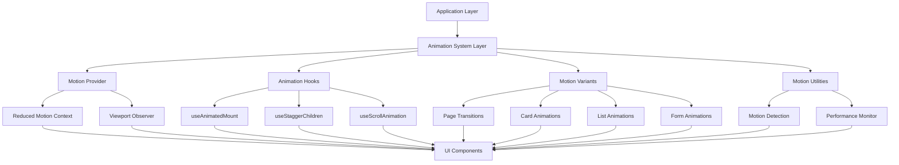

# Technical Design: UI/UX Premium Polish

## Overview

This design document specifies the technical implementation of premium UI/UX enhancements for the ASTU Stock Management System. The goal is to integrate framer-motion v13.1.1, react-countup v6.5.3, and vaul v1.1.2 to add professional animations and micro-interactions while maintaining the existing "Ledger" design identity, performance standards, and accessibility requirements.

### Design Philosophy

The enhancements follow three core principles:

1. **Subtle Over Showy**: Animations should feel like polish, not decoration. Motion reinforces hierarchy and user intent rather than drawing attention to itself.

2. **Performance First**: All animations must maintain 60fps and respect system preferences (prefers-reduced-motion). Use hardware-accelerated properties (transform, opacity) exclusively.

3. **Seamless Integration**: New animation capabilities must integrate cleanly with existing component patterns, design tokens, and both light/dark themes without requiring wholesale refactoring.

### Technical Approach

The implementation strategy involves:

- **Animation System Layer**: A centralized motion configuration system that provides reusable variants, hooks, and utilities
- **Progressive Enhancement**: Enhance existing components with motion capabilities while preserving their current API and behavior
- **Token-Based Timing**: Use existing CSS custom properties (--dur-instant, --dur-fast, --dur-base, --ease-out) for consistent timing
- **Accessibility-First**: Built-in reduced-motion support and focus management

### Key Dependencies

- **framer-motion v13.1.1**: Core animation engine for page transitions, component animations, and gestures
- **react-countup v6.5.3**: Animated numeric displays for KPIs and dashboard metrics
- **vaul v1.1.2**: Mobile-optimized drawer component with native-feeling gestures

## Architecture

### System Layers



### Component Integration Strategy

The animation system integrates with existing components through composition rather than modification:

1. **Wrapper Pattern**: Existing components receive motion-enhanced wrappers (e.g., `AnimatedCard` wraps `Card`)
2. **Hook-Based Enhancement**: Components use animation hooks to add motion capabilities (e.g., `useStaggerChildren`)
3. **Variant Props**: Motion variants are passed as props, allowing components to opt into specific animation behaviors

This approach ensures:
- Existing components remain unchanged and backward compatible
- Animation features can be adopted incrementally
- Non-animated versions remain available for static contexts

### File Structure

```
src/
├── components/
│   ├── ui/                      # Existing UI components (unchanged)
│   │   ├── button.tsx
│   │   ├── card.tsx
│   │   ├── dialog.tsx
│   │   └── ...
│   │
│   ├── motion/                  # New animation system
│   │   ├── providers/
│   │   │   ├── MotionProvider.tsx        # Global motion config & context
│   │   │   └── ViewportObserver.tsx      # Scroll-triggered animations
│   │   │
│   │   ├── variants/
│   │   │   ├── page.ts                   # Page transition variants
│   │   │   ├── card.ts                   # Card animation variants
│   │   │   ├── list.ts                   # List & stagger variants
│   │   │   ├── form.ts                   # Form input variants
│   │   │   └── index.ts                  # Variant exports
│   │   │
│   │   ├── hooks/
│   │   │   ├── useAnimatedMount.ts       # Component mount animations
│   │   │   ├── useStaggerChildren.ts     # Staggered list animations
│   │   │   ├── useScrollAnimation.ts     # Scroll-triggered animations
│   │   │   ├── useReducedMotion.ts       # Motion preference detection
│   │   │   └── index.ts                  # Hook exports
│   │   │
│   │   ├── animated/
│   │   │   ├── AnimatedCard.tsx          # Motion-enhanced card
│   │   │   ├── AnimatedButton.tsx        # Motion-enhanced button
│   │   │   ├── AnimatedList.tsx          # Staggered list container
│   │   │   ├── AnimatedPage.tsx          # Page transition wrapper
│   │   │   ├── AnimatedModal.tsx         # Modal with animations
│   │   │   ├── CountUp.tsx               # Wrapper for react-countup
│   │   │   ├── Drawer.tsx                # Vaul drawer integration
│   │   │   └── index.ts                  # Component exports
│   │   │
│   │   └── utils/
│   │       ├── motion-config.ts          # Global motion configuration
│   │       ├── performance.ts            # Performance monitoring
│   │       └── index.ts                  # Utility exports
│   │
│   └── app/                     # Existing app components
│       ├── providers.tsx        # Updated to include MotionProvider
│       └── ...
│
└── lib/
    └── constants/
        └── motion-tokens.ts     # Duration & easing constants
```

## Components and Interfaces

### Motion Provider

The `MotionProvider` component wraps the application and provides global motion configuration and context.

```typescript
// src/components/motion/providers/MotionProvider.tsx
import { createContext, useContext, ReactNode } from 'react'
import { MotionConfig } from 'framer-motion'

interface MotionContextValue {
  reducedMotion: boolean
  enableScrollAnimations: boolean
}

const MotionContext = createContext<MotionContextValue>({
  reducedMotion: false,
  enableScrollAnimations: true,
})

export function useMotionContext() {
  return useContext(MotionContext)
}

interface MotionProviderProps {
  children: ReactNode
  reducedMotion?: boolean
}

export function MotionProvider({ 
  children, 
  reducedMotion: forcedReducedMotion 
}: MotionProviderProps) {
  const prefersReducedMotion = 
    forcedReducedMotion ?? 
    typeof window !== 'undefined' && 
    window.matchMedia('(prefers-reduced-motion: reduce)').matches

  const contextValue: MotionContextValue = {
    reducedMotion: prefersReducedMotion,
    enableScrollAnimations: !prefersReducedMotion,
  }

  return (
    <MotionContext.Provider value={contextValue}>
      <MotionConfig reducedMotion={prefersReducedMotion ? "always" : "never"}>
        {children}
      </MotionConfig>
    </MotionContext.Provider>
  )
}
```

**Integration Point**: Add to `src/components/providers.tsx`:

```typescript
export function Providers({ children }: { children: ReactNode }) {
  return (
    <QueryClientProvider client={queryClient}>
      <MotionProvider>
        {/* existing providers */}
        {children}
      </MotionProvider>
    </QueryClientProvider>
  )
}
```

### Motion Tokens

Centralized constants that map to CSS custom properties defined in globals.css.

```typescript
// src/lib/constants/motion-tokens.ts

export const DURATION = {
  instant: 90,    // --dur-instant
  fast: 140,      // --dur-fast
  base: 200,      // --dur-base
  slow: 300,
  skeleton: 1600, // --dur-base * 8
  countup: 1200,
} as const

export const EASING = {
  out: [0.22, 1, 0.36, 1],      // --ease-out (strong deceleration)
  standard: [0.4, 0, 0.2, 1],   // --ease-standard
  spring: { type: 'spring', stiffness: 300, damping: 25 },
  springGentle: { type: 'spring', stiffness: 200, damping: 20 },
} as const

export const STAGGER = {
  list: 0.03,      // 30ms between list items
  widget: 0.08,    // 80ms between dashboard widgets
  form: 0.05,      // 50ms between form fields
} as const
```

### Animation Variants

Reusable motion variants for common animation patterns.

```typescript
// src/components/motion/variants/page.ts
import { Variants } from 'framer-motion'
import { DURATION, EASING } from '@/lib/constants/motion-tokens'

export const pageVariants: Variants = {
  initial: {
    opacity: 0,
    y: 8,
  },
  animate: {
    opacity: 1,
    y: 0,
    transition: {
      duration: DURATION.base / 1000,
      ease: EASING.out,
    },
  },
  exit: {
    opacity: 0,
    y: -8,
    transition: {
      duration: DURATION.fast / 1000,
      ease: EASING.out,
    },
  },
}
```

```typescript
// src/components/motion/variants/card.ts
import { Variants } from 'framer-motion'
import { DURATION, EASING } from '@/lib/constants/motion-tokens'

export const cardVariants: Variants = {
  idle: {
    y: 0,
    scale: 1,
    transition: {
      duration: DURATION.fast / 1000,
      ease: EASING.out,
    },
  },
  hover: {
    y: -2,
    scale: 1.005,
    transition: {
      duration: DURATION.fast / 1000,
      ease: EASING.out,
    },
  },
  press: {
    scale: 0.995,
    transition: {
      duration: DURATION.instant / 1000,
      ease: EASING.out,
    },
  },
}

export const cardEntranceVariants: Variants = {
  hidden: {
    opacity: 0,
    y: 16,
  },
  visible: {
    opacity: 1,
    y: 0,
    transition: {
      duration: DURATION.base / 1000,
      ease: EASING.out,
    },
  },
}
```

```typescript
// src/components/motion/variants/list.ts
import { Variants } from 'framer-motion'
import { DURATION, EASING, STAGGER } from '@/lib/constants/motion-tokens'

export const listContainerVariants: Variants = {
  hidden: { opacity: 0 },
  visible: {
    opacity: 1,
    transition: {
      staggerChildren: STAGGER.list,
      delayChildren: 0,
    },
  },
}

export const listItemVariants: Variants = {
  hidden: {
    opacity: 0,
    y: 8,
  },
  visible: {
    opacity: 1,
    y: 0,
    transition: {
      duration: DURATION.base / 1000,
      ease: EASING.out,
    },
  },
}

// Performance optimization: only animate first N items
export const createStaggerVariants = (maxItems: number = 20) => ({
  container: {
    hidden: { opacity: 0 },
    visible: {
      opacity: 1,
      transition: {
        staggerChildren: STAGGER.list,
        delayChildren: 0,
      },
    },
  },
  item: (index: number) => ({
    hidden: {
      opacity: index < maxItems ? 0 : 1,
      y: index < maxItems ? 8 : 0,
    },
    visible: {
      opacity: 1,
      y: 0,
      transition: index < maxItems ? {
        duration: DURATION.base / 1000,
        ease: EASING.out,
      } : { duration: 0 },
    },
  }),
})
```

```typescript
// src/components/motion/variants/form.ts
import { Variants } from 'framer-motion'
import { DURATION, EASING } from '@/lib/constants/motion-tokens'

export const formInputVariants: Variants = {
  idle: {
    scale: 1,
  },
  focus: {
    scale: 1.01,
    transition: {
      duration: DURATION.instant / 1000,
      ease: EASING.out,
    },
  },
}

export const formLabelVariants: Variants = {
  idle: {
    y: 0,
  },
  focus: {
    y: -2,
    transition: {
      duration: DURATION.instant / 1000,
      ease: EASING.out,
    },
  },
}

export const validationVariants: Variants = {
  success: {
    scale: [0, 1],
    opacity: [0, 1],
    transition: {
      duration: DURATION.base / 1000,
      ease: EASING.spring,
    },
  },
  error: {
    x: [-4, 4, -4, 0],
    transition: {
      duration: DURATION.fast / 1000,
      ease: EASING.out,
    },
  },
}
```

### Animation Hooks

Custom hooks that encapsulate common animation patterns.

```typescript
// src/components/motion/hooks/useReducedMotion.ts
import { useMotionContext } from '../providers/MotionProvider'

export function useReducedMotion() {
  const { reducedMotion } = useMotionContext()
  return reducedMotion
}
```

```typescript
// src/components/motion/hooks/useAnimatedMount.ts
import { useReducedMotion } from './useReducedMotion'

interface AnimatedMountOptions {
  duration?: number
  delay?: number
}

export function useAnimatedMount({ 
  duration = 200, 
  delay = 0 
}: AnimatedMountOptions = {}) {
  const reducedMotion = useReducedMotion()
  
  return {
    initial: reducedMotion ? false : { opacity: 0, y: 8 },
    animate: { opacity: 1, y: 0 },
    transition: {
      duration: reducedMotion ? 0.01 : duration / 1000,
      delay: reducedMotion ? 0 : delay / 1000,
      ease: [0.22, 1, 0.36, 1],
    },
  }
}
```

```typescript
// src/components/motion/hooks/useStaggerChildren.ts
import { useReducedMotion } from './useReducedMotion'

interface StaggerOptions {
  staggerDelay?: number
  itemDuration?: number
  maxItems?: number
}

export function useStaggerChildren({
  staggerDelay = 30,
  itemDuration = 200,
  maxItems = 20,
}: StaggerOptions = {}) {
  const reducedMotion = useReducedMotion()

  if (reducedMotion) {
    return {
      container: { opacity: 1 },
      item: { opacity: 1, y: 0 },
    }
  }

  return {
    container: {
      hidden: { opacity: 0 },
      visible: {
        opacity: 1,
        transition: {
          staggerChildren: staggerDelay / 1000,
          delayChildren: 0,
        },
      },
    },
    item: (index: number) => ({
      hidden: {
        opacity: index < maxItems ? 0 : 1,
        y: index < maxItems ? 8 : 0,
      },
      visible: {
        opacity: 1,
        y: 0,
        transition: index < maxItems ? {
          duration: itemDuration / 1000,
          ease: [0.22, 1, 0.36, 1],
        } : { duration: 0.01 },
      },
    }),
  }
}
```

```typescript
// src/components/motion/hooks/useScrollAnimation.ts
import { useInView } from 'framer-motion'
import { useRef } from 'react'
import { useReducedMotion } from './useReducedMotion'
import { useMotionContext } from '../providers/MotionProvider'

interface ScrollAnimationOptions {
  once?: boolean
  amount?: number | 'some' | 'all'
  margin?: string
}

export function useScrollAnimation({
  once = true,
  amount = 0.3,
  margin = '0px 0px -100px 0px',
}: ScrollAnimationOptions = {}) {
  const ref = useRef<HTMLDivElement>(null)
  const reducedMotion = useReducedMotion()
  const { enableScrollAnimations } = useMotionContext()
  
  const isInView = useInView(ref, {
    once,
    amount,
    margin,
  })

  const shouldAnimate = !reducedMotion && enableScrollAnimations
  const isVisible = !shouldAnimate || isInView

  return {
    ref,
    isInView,
    isVisible,
    animate: isVisible ? 'visible' : 'hidden',
  }
}
```

### Animated Components

Motion-enhanced wrappers for existing UI components.

```typescript
// src/components/motion/animated/AnimatedCard.tsx
'use client'

import { motion, HTMLMotionProps } from 'framer-motion'
import { Card } from '@/components/ui/card'
import { cardVariants, cardEntranceVariants } from '../variants/card'
import { useReducedMotion } from '../hooks/useReducedMotion'
import { cn } from '@/lib/utils'

interface AnimatedCardProps extends HTMLMotionProps<'div'> {
  interactive?: boolean
  entrance?: boolean
  className?: string
}

export function AnimatedCard({ 
  interactive = false,
  entrance = false,
  className,
  children,
  ...props 
}: AnimatedCardProps) {
  const reducedMotion = useReducedMotion()

  if (reducedMotion) {
    return <Card className={className}>{children}</Card>
  }

  if (entrance) {
    return (
      <motion.div
        initial="hidden"
        animate="visible"
        variants={cardEntranceVariants}
        {...props}
      >
        <Card className={className}>{children}</Card>
      </motion.div>
    )
  }

  if (interactive) {
    return (
      <motion.div
        initial="idle"
        whileHover="hover"
        whileTap="press"
        variants={cardVariants}
        style={{ transformOrigin: 'center' }}
        {...props}
      >
        <Card className={cn('astu-card-hover', className)}>
          {children}
        </Card>
      </motion.div>
    )
  }

  return <Card className={className}>{children}</Card>
}
```

```typescript
// src/components/motion/animated/AnimatedList.tsx
'use client'

import { motion } from 'framer-motion'
import { ReactNode } from 'react'
import { useStaggerChildren } from '../hooks/useStaggerChildren'

interface AnimatedListProps {
  children: ReactNode[]
  staggerDelay?: number
  maxItems?: number
  className?: string
}

export function AnimatedList({ 
  children, 
  staggerDelay = 30,
  maxItems = 20,
  className 
}: AnimatedListProps) {
  const variants = useStaggerChildren({ staggerDelay, maxItems })

  return (
    <motion.div
      initial="hidden"
      animate="visible"
      variants={variants.container}
      className={className}
    >
      {children.map((child, index) => (
        <motion.div
          key={index}
          custom={index}
          variants={variants.item}
        >
          {child}
        </motion.div>
      ))}
    </motion.div>
  )
}
```

```typescript
// src/components/motion/animated/CountUp.tsx
'use client'

import ReactCountUp from 'react-countup'
import { useReducedMotion } from '../hooks/useReducedMotion'
import { DURATION, EASING } from '@/lib/constants/motion-tokens'

interface CountUpProps {
  end: number
  start?: number
  decimals?: number
  duration?: number
  prefix?: string
  suffix?: string
  separator?: string
  decimal?: string
  useInView?: boolean
  className?: string
}

export function CountUp({
  end,
  start = 0,
  decimals = 0,
  duration = DURATION.countup / 1000,
  prefix = '',
  suffix = '',
  separator = ',',
  decimal = '.',
  useInView = true,
  className,
}: CountUpProps) {
  const reducedMotion = useReducedMotion()

  // Skip animation if reduced motion is enabled
  if (reducedMotion) {
    const formatted = new Intl.NumberFormat('en-US', {
      minimumFractionDigits: decimals,
      maximumFractionDigits: decimals,
    }).format(end)
    
    return (
      <span className={className}>
        {prefix}{formatted}{suffix}
      </span>
    )
  }

  return (
    <ReactCountUp
      start={start}
      end={end}
      decimals={decimals}
      duration={duration}
      prefix={prefix}
      suffix={suffix}
      separator={separator}
      decimal={decimal}
      enableScrollSpy={useInView}
      scrollSpyOnce
      useEasing
      easingFn={(t: number, b: number, c: number, d: number) => {
        // Custom easeOut function matching --ease-out
        // Using cubic-bezier(0.22, 1, 0.36, 1) approximation
        t /= d
        return c * (1 - Math.pow(1 - t, 3)) + b
      }}
      className={className}
    />
  )
}
```

```typescript
// src/components/motion/animated/Drawer.tsx
'use client'

import { Drawer as VaulDrawer } from 'vaul'
import { ReactNode } from 'react'
import { cn } from '@/lib/utils'

interface DrawerProps {
  open: boolean
  onOpenChange: (open: boolean) => void
  children: ReactNode
  direction?: 'top' | 'bottom' | 'left' | 'right'
}

export function Drawer({ 
  open, 
  onOpenChange, 
  children,
  direction = 'bottom' 
}: DrawerProps) {
  return (
    <VaulDrawer.Root 
      open={open} 
      onOpenChange={onOpenChange}
      direction={direction}
    >
      {children}
    </VaulDrawer.Root>
  )
}

interface DrawerContentProps {
  className?: string
  children: ReactNode
}

export function DrawerContent({ className, children }: DrawerContentProps) {
  return (
    <VaulDrawer.Portal>
      <VaulDrawer.Overlay className="fixed inset-0 bg-black/40" />
      <VaulDrawer.Content
        className={cn(
          'fixed bottom-0 left-0 right-0 mt-24 flex h-auto flex-col rounded-t-[10px] bg-card',
          className
        )}
      >
        <div className="mx-auto mt-4 h-1.5 w-12 flex-shrink-0 rounded-full bg-muted" />
        <div className="flex-1 overflow-auto p-6">
          {children}
        </div>
      </VaulDrawer.Content>
    </VaulDrawer.Portal>
  )
}

export const DrawerTrigger = VaulDrawer.Trigger
export const DrawerTitle = VaulDrawer.Title
export const DrawerDescription = VaulDrawer.Description
export const DrawerClose = VaulDrawer.Close
```

```typescript
// src/components/motion/animated/AnimatedPage.tsx
'use client'

import { motion } from 'framer-motion'
import { ReactNode } from 'react'
import { pageVariants } from '../variants/page'
import { useReducedMotion } from '../hooks/useReducedMotion'

interface AnimatedPageProps {
  children: ReactNode
  className?: string
}

export function AnimatedPage({ children, className }: AnimatedPageProps) {
  const reducedMotion = useReducedMotion()

  if (reducedMotion) {
    return <div className={className}>{children}</div>
  }

  return (
    <motion.div
      initial="initial"
      animate="animate"
      exit="exit"
      variants={pageVariants}
      className={className}
    >
      {children}
    </motion.div>
  )
}
```

```typescript
// src/components/motion/animated/AnimatedModal.tsx
'use client'

import { motion, AnimatePresence } from 'framer-motion'
import { ReactNode } from 'react'
import { DURATION, EASING } from '@/lib/constants/motion-tokens'
import { useReducedMotion } from '../hooks/useReducedMotion'
import { cn } from '@/lib/utils'

interface AnimatedModalProps {
  open: boolean
  onClose: () => void
  children: ReactNode
  className?: string
}

export function AnimatedModal({ 
  open, 
  onClose, 
  children, 
  className 
}: AnimatedModalProps) {
  const reducedMotion = useReducedMotion()

  const overlayVariants = {
    hidden: { opacity: 0 },
    visible: { 
      opacity: 1,
      transition: { duration: DURATION.fast / 1000 }
    },
  }

  const contentVariants = {
    hidden: { 
      opacity: 0, 
      scale: 0.95,
      y: 10,
    },
    visible: { 
      opacity: 1, 
      scale: 1,
      y: 0,
      transition: { 
        duration: DURATION.base / 1000,
        ease: EASING.out,
      }
    },
  }

  return (
    <AnimatePresence>
      {open && (
        <>
          <motion.div
            initial={reducedMotion ? false : "hidden"}
            animate="visible"
            exit="hidden"
            variants={overlayVariants}
            className="fixed inset-0 z-50 bg-black/50"
            onClick={onClose}
          />
          <motion.div
            initial={reducedMotion ? false : "hidden"}
            animate="visible"
            exit="hidden"
            variants={contentVariants}
            className={cn(
              'fixed left-1/2 top-1/2 z-50 -translate-x-1/2 -translate-y-1/2',
              className
            )}
          >
            {children}
          </motion.div>
        </>
      )}
    </AnimatePresence>
  )
}
```

### Performance Utilities

```typescript
// src/components/motion/utils/performance.ts

/**
 * Monitor animation performance and log warnings if frame rate drops
 */
export class AnimationPerformanceMonitor {
  private frameCount = 0
  private lastTime = performance.now()
  private isMonitoring = false
  private animationFrameId?: number

  start() {
    if (this.isMonitoring) return
    this.isMonitoring = true
    this.frameCount = 0
    this.lastTime = performance.now()
    this.measure()
  }

  stop() {
    this.isMonitoring = false
    if (this.animationFrameId) {
      cancelAnimationFrame(this.animationFrameId)
    }
  }

  private measure = () => {
    if (!this.isMonitoring) return

    this.frameCount++
    const currentTime = performance.now()
    const elapsed = currentTime - this.lastTime

    // Check every second
    if (elapsed >= 1000) {
      const fps = Math.round((this.frameCount * 1000) / elapsed)
      
      if (fps < 55) {
        console.warn(`Animation performance warning: ${fps} FPS (target: 60)`)
      }

      this.frameCount = 0
      this.lastTime = currentTime
    }

    this.animationFrameId = requestAnimationFrame(this.measure)
  }
}

export const performanceMonitor = new AnimationPerformanceMonitor()

/**
 * Debounce utility for scroll and resize events
 */
export function debounce<T extends (...args: any[]) => any>(
  func: T,
  wait: number
): (...args: Parameters<T>) => void {
  let timeout: NodeJS.Timeout | null = null

  return function executedFunction(...args: Parameters<T>) {
    const later = () => {
      timeout = null
      func(...args)
    }

    if (timeout) {
      clearTimeout(timeout)
    }
    timeout = setTimeout(later, wait)
  }
}
```

## Data Models

### Motion Context State

```typescript
interface MotionContextValue {
  // User preference for reduced motion
  reducedMotion: boolean
  
  // Enable/disable scroll-triggered animations globally
  enableScrollAnimations: boolean
}
```

### Animation Configuration

```typescript
interface AnimationConfig {
  // Duration values in milliseconds
  duration: {
    instant: number    // 90ms
    fast: number       // 140ms
    base: number       // 200ms
    slow: number       // 300ms
    skeleton: number   // 1600ms
    countup: number    // 1200ms
  }
  
  // Easing curves
  easing: {
    out: number[]           // cubic-bezier(0.22, 1, 0.36, 1)
    standard: number[]      // cubic-bezier(0.4, 0, 0.2, 1)
    spring: object          // spring physics config
    springGentle: object    // gentler spring config
  }
  
  // Stagger delays in seconds
  stagger: {
    list: number      // 0.03s
    widget: number    // 0.08s
    form: number      // 0.05s
  }
}
```

### Component Props

```typescript
// AnimatedCard Props
interface AnimatedCardProps extends HTMLMotionProps<'div'> {
  interactive?: boolean   // Enable hover/press animations
  entrance?: boolean      // Animate on mount
  className?: string
}

// AnimatedList Props
interface AnimatedListProps {
  children: ReactNode[]
  staggerDelay?: number   // Delay between items (ms)
  maxItems?: number       // Max items to animate (performance)
  className?: string
}

// CountUp Props
interface CountUpProps {
  end: number              // Target value
  start?: number           // Starting value (default: 0)
  decimals?: number        // Decimal places
  duration?: number        // Animation duration (seconds)
  prefix?: string          // e.g., "$"
  suffix?: string          // e.g., "%"
  separator?: string       // Thousands separator (default: ",")
  decimal?: string         // Decimal separator (default: ".")
  useInView?: boolean      // Trigger when entering viewport
  className?: string
}

// Drawer Props
interface DrawerProps {
  open: boolean
  onOpenChange: (open: boolean) => void
  children: ReactNode
  direction?: 'top' | 'bottom' | 'left' | 'right'
}
```

### Variant Types

```typescript
import { Variants } from 'framer-motion'

// Page transition variants
type PageVariants = Variants & {
  initial: { opacity: number; y: number }
  animate: { opacity: number; y: number; transition: object }
  exit: { opacity: number; y: number; transition: object }
}

// Card animation variants
type CardVariants = Variants & {
  idle: { y: number; scale: number; transition: object }
  hover: { y: number; scale: number; transition: object }
  press: { scale: number; transition: object }
}

// List stagger variants
type ListVariants = Variants & {
  hidden: { opacity: number }
  visible: { opacity: number; transition: object }
}
```

## Error Handling

### Motion Provider Errors

**Error**: `window.matchMedia` not available during SSR

**Handling**: Use optional chaining and default to `false`:

```typescript
const prefersReducedMotion = 
  typeof window !== 'undefined' && 
  window.matchMedia('(prefers-reduced-motion: reduce)').matches
```

**Impact**: Ensures server-side rendering works without runtime errors

---

**Error**: Framer Motion hydration mismatch

**Handling**: Mark motion components as client-only with `'use client'` directive

**Impact**: Prevents React hydration errors when initial server state differs from client

### Animation Performance Errors

**Error**: Frame rate drops below 55 FPS during animations

**Handling**: 
- Log performance warnings to console
- Automatically reduce stagger complexity
- Respect `maxItems` limit for list animations

```typescript
if (fps < 55) {
  console.warn(`Animation performance warning: ${fps} FPS`)
  // Reduce animation complexity
  staggerDelay = Math.max(staggerDelay * 0.5, 10)
}
```

**Impact**: Maintains smooth user experience on lower-end devices

---

**Error**: `will-change` overuse causing GPU memory issues

**Handling**: Only apply `will-change` during active animations, remove after completion:

```typescript
// In motion components, framer-motion handles this automatically
// Manual handling for CSS animations:
element.style.willChange = 'transform, opacity'
element.addEventListener('transitionend', () => {
  element.style.willChange = 'auto'
})
```

**Impact**: Prevents GPU memory exhaustion and browser slowdown

### Accessibility Errors

**Error**: Reduced motion preference not respected

**Handling**: Always check `useReducedMotion()` hook before applying animations:

```typescript
const reducedMotion = useReducedMotion()

if (reducedMotion) {
  // Return static version
  return <Card>{children}</Card>
}

// Return animated version
return <motion.div {...animationProps}>{children}</motion.div>
```

**Impact**: Ensures WCAG 2.1 compliance and prevents vestibular disorders

---

**Error**: Focus lost during modal/drawer animations

**Handling**: Use Radix UI's built-in focus management:

```typescript
<Dialog.Root onOpenChange={(open) => {
  if (!open) {
    // Focus is automatically restored by Radix
    // to the trigger element
  }
}}>
```

For custom drawers, manually restore focus:

```typescript
const [lastFocusedElement, setLastFocusedElement] = useState<HTMLElement>()

const handleClose = () => {
  onClose()
  lastFocusedElement?.focus()
}
```

**Impact**: Maintains keyboard navigation accessibility

### Animation Library Errors

**Error**: react-countup throws on invalid numeric values

**Handling**: Validate and sanitize input values:

```typescript
const safeEnd = Number.isFinite(end) ? end : 0
const safeStart = Number.isFinite(start) ? start : 0

<CountUp end={safeEnd} start={safeStart} />
```

**Impact**: Prevents crashes when API returns malformed numeric data

---

**Error**: Vaul drawer conflicts with scroll lock

**Handling**: Ensure only one scroll lock is active at a time:

```typescript
// Vaul handles scroll lock internally
// Avoid using additional scroll-lock libraries
// If using react-remove-scroll elsewhere, disable it when drawer is open

<Drawer.Root open={open}>
  {/* Vaul manages scroll lock */}
</Drawer.Root>
```

**Impact**: Prevents layout shift and scroll jumping

### Graceful Degradation

**Strategy**: All animations degrade gracefully when:

1. **Reduced motion is enabled**: Components render immediately without animation
2. **JavaScript fails**: CSS fallbacks ensure UI remains functional
3. **Old browsers**: Feature detection prevents errors

```typescript
// Feature detection for IntersectionObserver
const supportsIntersectionObserver = 
  typeof window !== 'undefined' && 
  'IntersectionObserver' in window

if (!supportsIntersectionObserver) {
  // Show content immediately
  return <div>{children}</div>
}

// Use scroll animations
return <AnimatedScrollSection>{children}</AnimatedScrollSection>
```

**Impact**: Ensures universal accessibility across all devices and preferences

## Testing Strategy

### Unit Testing Approach

Unit tests verify individual animation components, hooks, and utilities in isolation. Focus on:

1. **Component rendering**: Ensure animated components render correctly
2. **Reduced motion handling**: Verify static fallbacks when motion is disabled
3. **Hook behavior**: Test custom hooks return expected values
4. **Variant generation**: Validate animation variant objects

**Testing Framework**: Vitest with React Testing Library

**Example Unit Tests**:

```typescript
// tests/unit/motion/AnimatedCard.test.tsx
import { render, screen } from '@testing-library/react'
import { AnimatedCard } from '@/components/motion/animated/AnimatedCard'
import { MotionProvider } from '@/components/motion/providers/MotionProvider'

describe('AnimatedCard', () => {
  it('renders children correctly', () => {
    render(
      <MotionProvider>
        <AnimatedCard>Test Content</AnimatedCard>
      </MotionProvider>
    )
    expect(screen.getByText('Test Content')).toBeInTheDocument()
  })

  it('renders static card when reduced motion is enabled', () => {
    render(
      <MotionProvider reducedMotion={true}>
        <AnimatedCard interactive>Test Content</AnimatedCard>
      </MotionProvider>
    )
    
    const card = screen.getByText('Test Content').parentElement
    // Verify no motion props are applied
    expect(card?.tagName).toBe('DIV') // Not motion.div
  })

  it('applies interactive hover classes when interactive prop is true', () => {
    const { container } = render(
      <MotionProvider>
        <AnimatedCard interactive>Test Content</AnimatedCard>
      </MotionProvider>
    )
    
    const card = container.querySelector('.astu-card-hover')
    expect(card).toBeInTheDocument()
  })
})
```

```typescript
// tests/unit/motion/hooks/useReducedMotion.test.tsx
import { renderHook } from '@testing-library/react'
import { useReducedMotion } from '@/components/motion/hooks/useReducedMotion'
import { MotionProvider } from '@/components/motion/providers/MotionProvider'

describe('useReducedMotion', () => {
  it('returns false when reduced motion is not enabled', () => {
    const { result } = renderHook(() => useReducedMotion(), {
      wrapper: ({ children }) => (
        <MotionProvider reducedMotion={false}>{children}</MotionProvider>
      ),
    })
    
    expect(result.current).toBe(false)
  })

  it('returns true when reduced motion is enabled', () => {
    const { result } = renderHook(() => useReducedMotion(), {
      wrapper: ({ children }) => (
        <MotionProvider reducedMotion={true}>{children}</MotionProvider>
      ),
    })
    
    expect(result.current).toBe(true)
  })
})
```

```typescript
// tests/unit/motion/CountUp.test.tsx
import { render, screen } from '@testing-library/react'
import { CountUp } from '@/components/motion/animated/CountUp'
import { MotionProvider } from '@/components/motion/providers/MotionProvider'

describe('CountUp', () => {
  it('displays final value immediately when reduced motion is enabled', () => {
    render(
      <MotionProvider reducedMotion={true}>
        <CountUp end={1234} separator="," />
      </MotionProvider>
    )
    
    expect(screen.getByText('1,234')).toBeInTheDocument()
  })

  it('applies prefix and suffix correctly', () => {
    render(
      <MotionProvider reducedMotion={true}>
        <CountUp end={99} prefix="$" suffix="%" />
      </MotionProvider>
    )
    
    expect(screen.getByText('$99%')).toBeInTheDocument()
  })

  it('handles decimal values', () => {
    render(
      <MotionProvider reducedMotion={true}>
        <CountUp end={3.14} decimals={2} />
      </MotionProvider>
    )
    
    expect(screen.getByText('3.14')).toBeInTheDocument()
  })
})
```

**Unit Test Coverage Goals**:
- 90%+ coverage for motion hooks
- 85%+ coverage for animated components
- 100% coverage for utility functions

---

### Integration Testing Approach

Integration tests verify that animation components work correctly with existing UI components and real user interactions.

**Testing Framework**: Vitest + React Testing Library + user-event

**Example Integration Tests**:

```typescript
// tests/integration/AnimatedCard.interaction.test.tsx
import { render, screen } from '@testing-library/react'
import userEvent from '@testing-library/user-event'
import { AnimatedCard } from '@/components/motion/animated/AnimatedCard'
import { MotionProvider } from '@/components/motion/providers/MotionProvider'
import { Button } from '@/components/ui/button'

describe('AnimatedCard Interactions', () => {
  it('responds to hover and click interactions', async () => {
    const user = userEvent.setup()
    const handleClick = vi.fn()
    
    render(
      <MotionProvider>
        <AnimatedCard interactive onClick={handleClick}>
          <Button>Click Me</Button>
        </AnimatedCard>
      </MotionProvider>
    )
    
    const button = screen.getByRole('button', { name: 'Click Me' })
    
    await user.hover(button)
    await user.click(button)
    
    expect(handleClick).toHaveBeenCalledTimes(1)
  })
})
```

```typescript
// tests/integration/Drawer.test.tsx
import { render, screen } from '@testing-library/react'
import userEvent from '@testing-library/user-event'
import { useState } from 'react'
import { 
  Drawer, 
  DrawerContent, 
  DrawerTrigger 
} from '@/components/motion/animated/Drawer'

function TestDrawer() {
  const [open, setOpen] = useState(false)
  
  return (
    <Drawer open={open} onOpenChange={setOpen}>
      <DrawerTrigger asChild>
        <button>Open Drawer</button>
      </DrawerTrigger>
      <DrawerContent>
        <p>Drawer Content</p>
        <button onClick={() => setOpen(false)}>Close</button>
      </DrawerContent>
    </Drawer>
  )
}

describe('Drawer', () => {
  it('opens and closes correctly', async () => {
    const user = userEvent.setup()
    render(<TestDrawer />)
    
    const trigger = screen.getByRole('button', { name: 'Open Drawer' })
    await user.click(trigger)
    
    expect(screen.getByText('Drawer Content')).toBeInTheDocument()
    
    const closeButton = screen.getByRole('button', { name: 'Close' })
    await user.click(closeButton)
    
    // Drawer should be removed from DOM
    await waitFor(() => {
      expect(screen.queryByText('Drawer Content')).not.toBeInTheDocument()
    })
  })

  it('restores focus to trigger on close', async () => {
    const user = userEvent.setup()
    render(<TestDrawer />)
    
    const trigger = screen.getByRole('button', { name: 'Open Drawer' })
    await user.click(trigger)
    
    const closeButton = screen.getByRole('button', { name: 'Close' })
    await user.click(closeButton)
    
    await waitFor(() => {
      expect(trigger).toHaveFocus()
    })
  })
})
```

---

### Visual Regression Testing

Visual regression tests capture screenshots and compare against baseline images to detect unintended visual changes.

**Testing Framework**: Playwright

**Test Scenarios**:
1. Card hover states (idle → hover → press)
2. Modal open/close animations
3. List stagger animations
4. Theme toggle transitions
5. Responsive layout adaptations

**Example Playwright Test**:

```typescript
// tests/e2e/visual-regression.spec.ts
import { test, expect } from '@playwright/test'

test.describe('Card Animations', () => {
  test('card hover state matches design', async ({ page }) => {
    await page.goto('/dashboard')
    
    const card = page.locator('[data-testid="kpi-card"]').first()
    
    // Idle state
    await expect(card).toHaveScreenshot('card-idle.png')
    
    // Hover state
    await card.hover()
    await page.waitForTimeout(200) // Wait for animation to complete
    await expect(card).toHaveScreenshot('card-hover.png')
  })

  test('respects reduced motion preference', async ({ page, context }) => {
    await context.emulateMedia({ reducedMotion: 'reduce' })
    await page.goto('/dashboard')
    
    const card = page.locator('[data-testid="kpi-card"]').first()
    
    // No animation should occur - immediate render
    await expect(card).toBeVisible()
    await expect(card).toHaveScreenshot('card-reduced-motion.png')
  })
})

test.describe('Theme Transitions', () => {
  test('theme toggle animates smoothly', async ({ page }) => {
    await page.goto('/dashboard')
    
    const themeToggle = page.locator('[aria-label="Toggle theme"]')
    
    // Light mode baseline
    await expect(page).toHaveScreenshot('theme-light.png')
    
    // Toggle to dark
    await themeToggle.click()
    await page.waitForTimeout(200) // Wait for transition
    
    await expect(page).toHaveScreenshot('theme-dark.png')
  })
})
```

---

### Performance Testing

Performance tests verify that animations maintain 60fps and don't cause memory leaks.

**Metrics to Track**:
- Frame rate during animations
- GPU memory usage
- JavaScript heap size
- Time to Interactive (TTI) impact
- Animation completion time

**Example Performance Test**:

```typescript
// tests/performance/animation-fps.test.ts
import { test, expect } from '@playwright/test'

test.describe('Animation Performance', () => {
  test('maintains 60fps during list stagger animation', async ({ page }) => {
    await page.goto('/inventory')
    
    // Start performance monitoring
    await page.evaluate(() => {
      (window as any).__fpsLog = []
      let lastTime = performance.now()
      let frameCount = 0
      
      function measureFPS() {
        frameCount++
        const currentTime = performance.now()
        const elapsed = currentTime - lastTime
        
        if (elapsed >= 1000) {
          const fps = Math.round((frameCount * 1000) / elapsed)
          ;(window as any).__fpsLog.push(fps)
          frameCount = 0
          lastTime = currentTime
        }
        
        requestAnimationFrame(measureFPS)
      }
      
      measureFPS()
    })
    
    // Trigger list animation
    await page.reload()
    await page.waitForTimeout(3000) // Monitor for 3 seconds
    
    // Retrieve FPS measurements
    const fpsLog = await page.evaluate(() => (window as any).__fpsLog)
    
    // Verify minimum FPS
    const minFPS = Math.min(...fpsLog)
    expect(minFPS).toBeGreaterThanOrEqual(55) // Allow 5fps buffer
    
    // Verify average FPS
    const avgFPS = fpsLog.reduce((a: number, b: number) => a + b) / fpsLog.length
    expect(avgFPS).toBeGreaterThanOrEqual(58)
  })

  test('animation load time impact under 50ms', async ({ page }) => {
    // Measure without animations
    await page.emulateMedia({ reducedMotion: 'reduce' })
    await page.goto('/dashboard')
    const baselineTTI = await page.evaluate(() => 
      performance.timing.domInteractive - performance.timing.navigationStart
    )
    
    // Measure with animations
    await page.emulateMedia({ reducedMotion: 'no-preference' })
    await page.goto('/dashboard')
    const animatedTTI = await page.evaluate(() => 
      performance.timing.domInteractive - performance.timing.navigationStart
    )
    
    const impact = animatedTTI - baselineTTI
    expect(impact).toBeLessThan(50)
  })
})
```

---

### Accessibility Testing

Accessibility tests ensure animations respect user preferences and maintain focus management.

**Testing Framework**: axe-core with Playwright

**Example Accessibility Tests**:

```typescript
// tests/accessibility/reduced-motion.test.ts
import { test, expect } from '@playwright/test'
import { injectAxe, checkA11y } from 'axe-playwright'

test.describe('Accessibility Compliance', () => {
  test('respects prefers-reduced-motion', async ({ page, context }) => {
    await context.emulateMedia({ reducedMotion: 'reduce' })
    await page.goto('/dashboard')
    
    // Verify no animations are running
    const hasAnimations = await page.evaluate(() => {
      const elements = document.querySelectorAll('*')
      return Array.from(elements).some(el => {
        const style = window.getComputedStyle(el)
        const animDuration = parseFloat(style.animationDuration || '0')
        const transDuration = parseFloat(style.transitionDuration || '0')
        return animDuration > 0.02 || transDuration > 0.02
      })
    })
    
    expect(hasAnimations).toBe(false)
  })

  test('maintains focus management in modal', async ({ page }) => {
    await page.goto('/dashboard')
    
    // Open modal
    await page.click('[data-testid="open-modal"]')
    
    // Verify focus is trapped in modal
    await page.keyboard.press('Tab')
    const focusedElement = await page.evaluate(() => 
      document.activeElement?.getAttribute('data-testid')
    )
    expect(focusedElement).toContain('modal')
    
    // Close modal
    await page.keyboard.press('Escape')
    
    // Verify focus returns to trigger
    const restoredFocus = await page.evaluate(() => 
      document.activeElement?.getAttribute('data-testid')
    )
    expect(restoredFocus).toBe('open-modal')
  })

  test('meets WCAG 2.1 Level AA', async ({ page }) => {
    await page.goto('/dashboard')
    await injectAxe(page)
    
    await checkA11y(page, null, {
      detailedReport: true,
      detailedReportOptions: {
        html: true,
      },
    })
  })
})
```

---

### Testing Best Practices

1. **Snapshot Tests for Variants**: Use Jest snapshots to track animation variant changes

```typescript
import { cardVariants } from '@/components/motion/variants/card'

describe('Card Variants', () => {
  it('matches snapshot', () => {
    expect(cardVariants).toMatchSnapshot()
  })
})
```

2. **Mock framer-motion in Unit Tests**: Prevent animation delays in fast unit tests

```typescript
// vitest.setup.ts
vi.mock('framer-motion', () => ({
  motion: {
    div: ({ children, ...props }: any) => <div {...props}>{children}</div>,
    // ... other elements
  },
  AnimatePresence: ({ children }: any) => children,
  useInView: () => true,
}))
```

3. **Test Animation Completion**: Verify animations complete before assertions

```typescript
import { waitFor } from '@testing-library/react'

await waitFor(() => {
  expect(element).toHaveStyle({ opacity: 1 })
}, { timeout: 500 })
```

4. **Separate Performance Tests**: Run performance tests separately from unit tests to avoid CI slowdown

```typescript
// package.json
{
  "scripts": {
    "test:unit": "vitest run tests/unit",
    "test:perf": "playwright test tests/performance",
    "test:a11y": "playwright test tests/accessibility"
  }
}
```

---

### Test Coverage Requirements

- **Unit Tests**: 85%+ coverage for motion system
- **Integration Tests**: Cover all major user workflows with animations
- **Visual Regression**: Baseline images for all animated states
- **Performance Tests**: Verify 60fps in CI environment
- **Accessibility Tests**: 100% compliance with WCAG 2.1 Level AA

**Continuous Integration**: All tests run on every PR. Performance and visual regression tests run on main branch only to reduce CI time.
